####**Note**: The [ORCA](https://orca.eto.tech) tool will be removed from the ETO website in early May. For more details, see [our ETO blog post](link here).

# ORCA: Open-source Software Research and Community Activity

This repository contains code related to the ORCA project. As this tool will no longer be available on the web soon, we also provide examples of the tool's interface and use below.

## Running the ORCA web application

### Running locally

Navigate to the [github-metrics](/github-metrics) subdirectory. If you have not installed
[Gatsby](https://www.gatsbyjs.com/docs/tutorial/getting-started/part-0/), do so, and then run

```
npm install
gatsby clean
gatsby develop
```

### Deploying to production

To update the production website, run `bash push_to_production.sh` to build the
site, push it to the production bucket, and update tags in the repository.

## Running data retrieval scripts

Data updates are automated via `orca_data_pipeline.py`. Additionally, a GitHub action runs once a month to open a PR that updates the data. You can merge this PR and update the production site after reviewing the changes. In short, you shouldn't have to run the steps below manually - these instructions are included in case of some special circumstance.

If the pipeline takes an unusually long time to run or the sensors are timing out, check the log files in the `airflow` user's home directory on `orca-etl`.

### Manually running data preprocessing

To manually run data preprocessing, ensure that the current data in `orca.website_stats` in BigQuery has been exported to GCS in `gs://airflow-data-exchange/orca/tmp/website_stats`. Then, run `PYTHONPATH='.' python3 scripts/preprocess_for_website.py`.

### Manually running data updates

The Airflow pipeline outlines the sequence of commands to run in more detail, but a quick summary:

* Run `sql/repos_in_papers.sql` to aggregate GitHub references that appear in papers. If you do not want to update
the software extracted from scholarly literature, skip this step.

* Prepare your development environment:

```bash
virtualenv venv
. venv/bin/activate
pip install -r requirements.txt
export GITHUB_ACCESS_TOKEN=your access token
export GITHUB_USER=your username
```

* Run `PYTHONPATH='.' python3 scripts/retrieve_repos.py` to retrieve a clean list of software to pull metadata from. You
can run with the `--query_bq` flag to retrieve software that appears in the scholarly literature (if you are a CSET
employee with BigQuery access) or `--query_topics` to retrieve software that matches the GitHub topics that appear in
`input_data/topics.txt`.

* At this point, we will have full metadata for repos we retrieved using the github API (i.e. repos retrieved
by topic, at the moment), but not for repos that only appear in papers or other sources. The next script
grabs the default metadata retrieved from the github API for repos that don't already have it:
`PYTHONPATH='.' python3 scripts/backfill_top_level_repo_data.py`

* Now, we can scrape some additional metadata from GitHub itself, including text of README.md files
which we can use to do further analysis.
Run `PYTHONPATH='.' python3 scripts/retrieve_repo_metadata.py curr_repos_filled.jsonl curr_repos_final.jsonl`

* To prepare data for the web application, load `curr_repos_final.jsonl` in the previous step into BigQuery and run
the sequence of queries in `sequences/downstream_order.txt`.

These steps are automated and run on a monthly basis on the scholarly literature data using the `orca_data_pipeline.py`
Airflow pipeline.

### Data provenance

* **Total stars** - This comes from the GitHub API (see `staging_github_metrics.repos_with_full_meta_raw.full_metadata.stargazers_count`)
* **Total watchers** - This comes from the GitHub API (see `staging_github_metrics.repos_with_full_meta_raw.full_metadata.subscribers_count`)
* **Total contributors** - This is scraped by `retrieve_repo_metadata.py` (TODO: maybe retrieve from gh archive)
* **Total references** - This comes from our scholarly literature (see `paper_meta` in `website_stats.sql`)
* **Total open issues** - This comes from the GitHub API (see `staging_github_metrics.repos_with_full_meta_raw.full_metadata.open_issues`)
* **Created date** - This comes from the GitHub API (see `staging_github_metrics.repos_with_full_meta_raw.full_metadata.created_at`)
* **Last push date** - This comes from the GitHub API (see `staging_github_metrics.repos_with_full_meta_raw.full_metadata.pushed_at`)
* **License** - This comes from the GitHub API (see `staging_github_metrics.repos_with_full_meta_raw.full_metadata.license.name`)
* **Top programming language** - This comes from the GitHub API (see `staging_github_metrics.repos_with_full_meta_raw.full_metadata.language`)
* **Stars over time** - This counts the number of `WatchEvent`s for the project in the githubarchive BQ public dataset. The sum of these counts
may not equal the total stars because users may unstar (or even unstar and re-star!) a repo
* **Commits over time** - This counts the number of distinct commits based on the unnested commits for `PushEvent`s
in the githubarchive BQ public dataset. See also `push_event_commits.sql`
* **Issues over time** - This counts the number of opened and closed issues based on `IssuesEvent`s
in the githubarchive BQ public dataset. See also `issue_events.sql`. We determine whether the issue was opened or closed based on the `action`
field
* **New versus returning contributors over time** - this metric is based on commits. If a contributor makes their first commit during a given time interval,
we mark them as a new contributor. Otherwise, they are a returning contributor. See combination of `repo_pushes` in `website_stats.sql`
and `get_new_vs_returning_contributor_counts` in `preprocess_for_website.py`.
* **Contribution percentages** - this metric is based on commits. For each contributor, we count their number of commits,
then calculate the percentage of commits written by each contributor. See combination of `repo_pushes` in `website_stats.sql` and
`get_cumulative_contributor_counts` in `preprocess_for_website.py`.
* **Cumulative percentage of contributions by number of contributors** - This metric is based on commits. See description of
Contribution percentages above, and `github-metrics/src/components/summary_panel.js:getContribTrace`
* The deps.dev links are added if the repo is present in `bigquery-public-data.deps_dev_v1`
* The pypi downloads over time come from `bigquery-public-data.pypi`

## Interface and Use

The primary interface of ORCA begins with an introduction to the tool, including a Quick Guide:

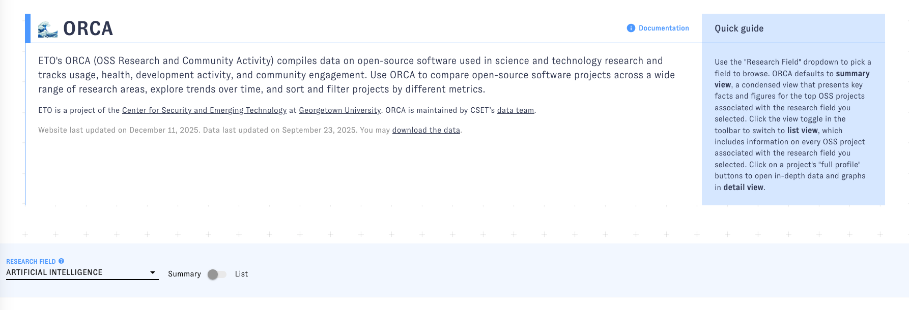

The initial view provides a summary of repositories in a selected research field:

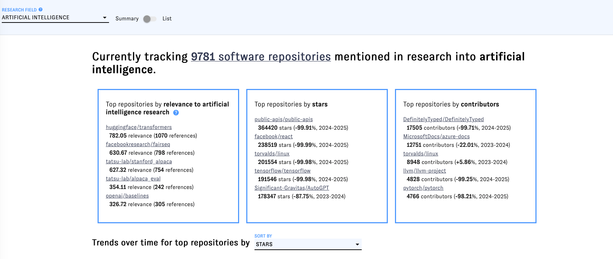

An array of different potential fields can be chosen:

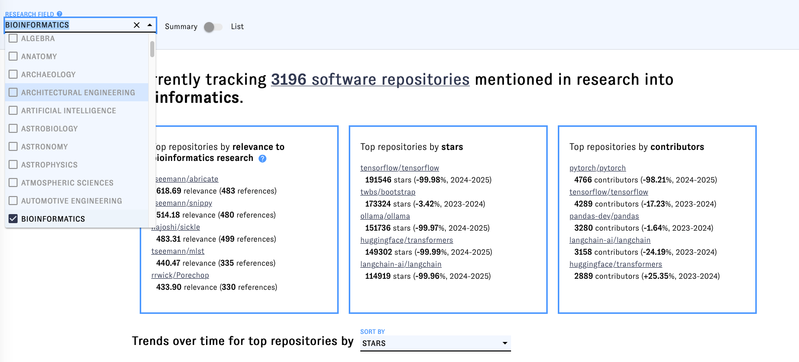

And the method of selecting the most relevant repositories can also be adjusted:

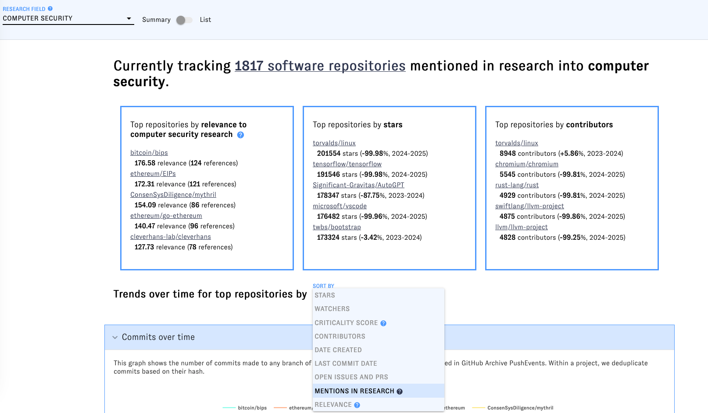

A number of other analyses of repositories by field are done, including commits over time:

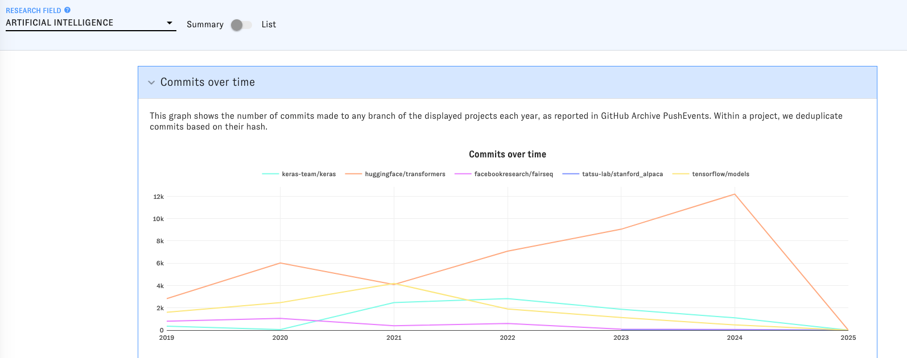

Ratio of issues and pull requests closed to opened over time:

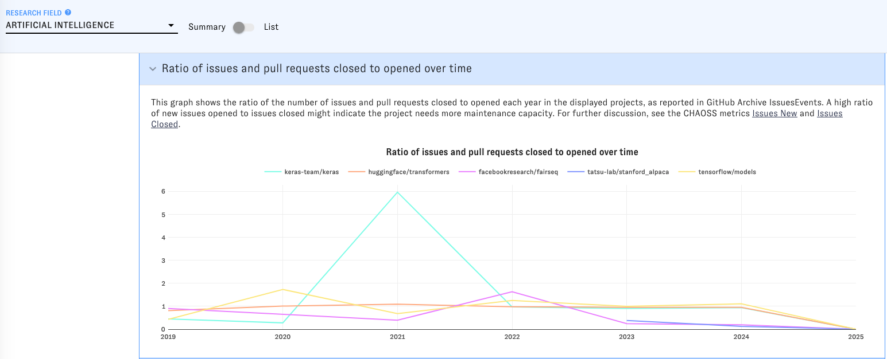

Ratio of new vs. returning contributors over time:

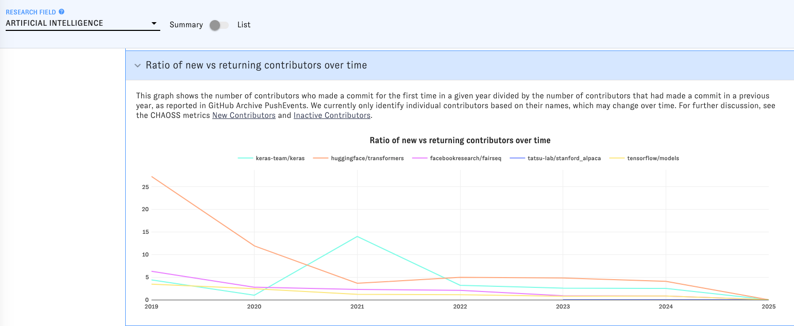

Percentage of commits by the top 20 contributors:

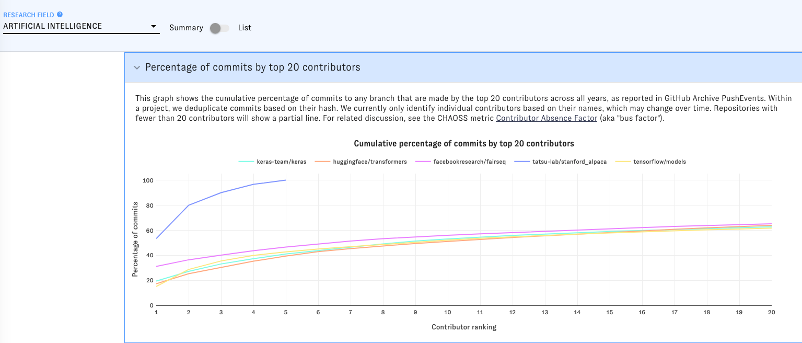

And stars over time:

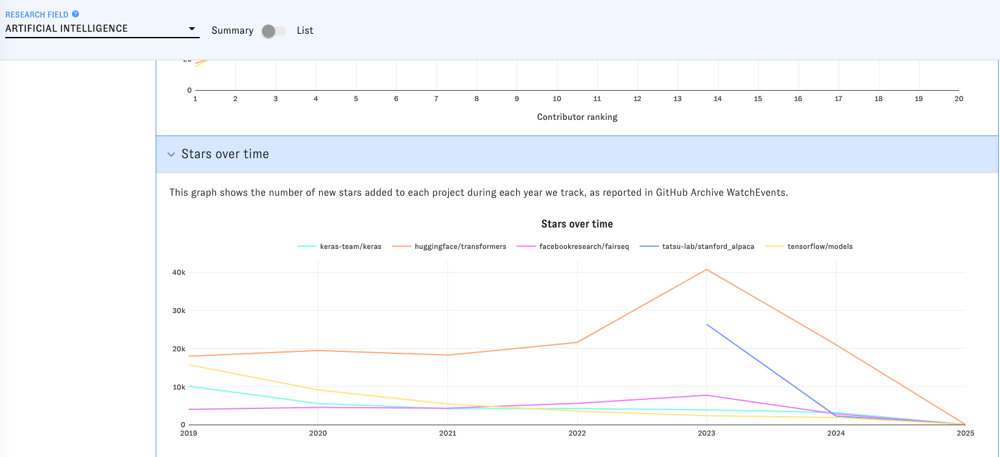

In addition to being able to view the initial analysis of repositories by field as a summary, you can also view it in list form:

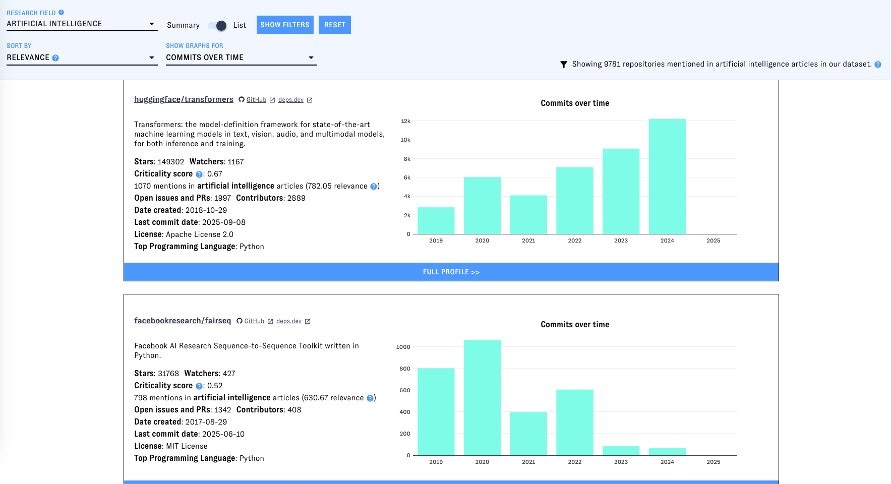

Individual repositories also let you view their full profile. This takes you to a separate page. That page looks like this:

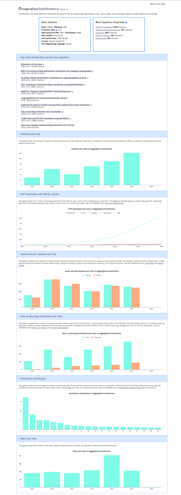